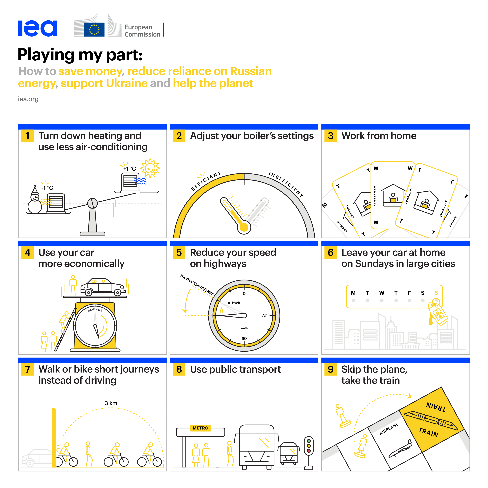

\clearpage 

# Saving energy at home {#sec:home}

Behavioural interventions to promote energy conservation at home have a long history, dating back to the first global energy crisis in the 1970s [@craig1978assessing].  These interventions encompass a wide range of targets. They can encourage households to adopt small behavioural changes, improve their homes, and invest in clean energy sources.

Figure \ref{playingmypart} illustrates the encouraging small behavioural changes approach with the “Playing My Part” information campaign launched by the European Commission in collaboration with the International Energy Agency (IEA) to tackle the energy crisis following Russia's invasion of Ukraine. This information campaign identified nine simple steps citizens can take to "save money, reduce reliance on Russian energy, support Ukraine, and help the planet." [According to IEA estimates](https://www.iea.org/reports/playing-my-part), EU households could make significant savings by following these recommendations (over EUR 450 per year) while helping the EU reduce oil consumption by 220 million barrels annually and save 17 billion cubic meters of gas.
 
{#playingmypart}

According to [the Bruegel's Database of National Energy Response to the Energy Crisis](https://www.bruegel.org/dataset/national-energy-policy-responses-energy-crisis), several EU countries launched similar information campaigns with energy-saving tips and guidelines for households, including the ["One Step Lower" campaign](https://www.astettaalemmas.fi) in Finland, the "I Have an Impact" in Belgium, and the "Saving at Home" in Greece. 

To accelerate energy-efficient investments, policymakers can use fiscal incentives to make people replace old electric appliances with energy-efficient new ones, renovate their buildings, or invest in alternative energy sources, such as solar panels. However, research shows that behavioural approaches complement these interventions and that economic incentives alone are insufficient in many cases [@jaffe1994energy] to convince people to change behaviour.

An illustrative example is [the “Solarize” program, which successfully leveraged social interactions and nudges to increase the adoption of photovoltaic panels in US cities](https://resources.environment.yale.edu/gillingham/GillinghamBollinger_SocialLearningPV.pdf).

It is crucial to emphasize that during an energy crisis, individuals tend to voluntarily decrease their energy consumption at home in anticipation of higher energy bills. This situation leads them to actively seek ways to modify their energy usage and seek methods to lower their energy consumption to reduce their bills. Consequently, behavioural interventions are particularly appealing in a crisis as they help lowering barriers to accessing this information. However, it's worth noting that government interventions aimed at stabilizing energy prices, while necessary to provide relief to vulnerable households, may inadvertently diminish the incentive for individuals to prioritize energy savings. Moreover, a large body of research shows that people tend to stick to their consumption patterns, despite economic gains from change, a situation also known as the Energy Paradox [@jaffe1994energy]. Therefore, energy-saving tips or information campaigns alone may not be sufficient to achieve the socially-desired levels of energy conservation.  

\Begin{keypoints}{Classical explanations for the Energy Paradox}
These are the classical economic explanations of why people tend to stick to their energy consumption patterns, despite economic gains from changing behaviour, according to @jaffe1994energy.

- \textbf{Information barriers} Individuals face multiple barriers in accessing or absorbing information. For example, a representative survey of Dutch households shows that only about half of respondents are aware of their monthly charges for energy consumption, and only 40\% understand the correct trade-off between different investment decisions in energy equipment [@brounen2013energy].

- \textbf{Time discounting} Investments in energy efficiency and, to some extent, significant behavioural changes involve individual costs. These costs are typically immediate (i.e., installation expenses), offering only delayed rewards (i.e., lower electricity bills). However, if households heavily discount the future, they would rather spend their time or money elsewhere today.

- \textbf{Heterogeneity in consumption}. Households are widely heterogeneous concerning their energy consumption patterns. Thus, even if a technology (or behaviour) is profitable on *average*, it may remain unattractive for a large portion of the population.

\End{keypoints}

Classical explanations for this paradox (see the Box) assume that individuals would make optimal decisions if they had more information about costs and benefits or if the market offered them more personalised solutions to save energy. However, much psychology and behavioural economics evidence have challenged these assumptions because people do not typically make optimal decisions if under the best conditions. On the contrary, individuals often act as if they were predictably "irrational" or biased. Here, we provide two examples of such behaviours. 

* **Time-inconsistent preferences**. People often delay or postpone action despite knowing there will be negative consequences, a form of procrastination. This phenomenon is known as inconsistent time preferences, where people make choices today that are inconsistent with their future well-being and preferences. For example, people prefer to keep their heating systems at high levels to stay warm and comfortable, but they systematically regret their decision when they receive a high energy bill.  For example, a recent study based on a survey with an experimental design shows that people who exhibited time-inconsistent preferences also tended to over-consume energy at home [@werthschulte2021role].  

* **Loss aversion**. Another example is that, when making energy decisions, individuals may find it too costly to deviate from their current energy consumption patterns or “status quo” because it involves giving up their current comfortable lifestyle, which they have become accustomed to. Therefore, they may resist making changes, even if the potential rewards are significant, due to the fear of loss. This phenomenon is known as loss aversion, where people fear losses more than they seek equivalent gains. A recent study, based on a large-scale survey of EU citizens, shows that individuals who are loss averse are less likely to invest in energy-efficient appliances or retrofit measures [@schleich2019large].

## Interventions to Save Energy at Home

The reasons for the Energy Paradox remain open, and the behavioural factors influencing households' energy decisions are still a topic of intense study. So, in this report, we take a more practical approach by exploring different interventions found to be successful in the academic literature. This will help us understand the challenges and effectiveness of other solutions.  Table \ref{tab:households} summarises the interventions discussed below.

\begin{table}[htbp!]
\centering
\begin{tabularx}{\textwidth}{lX}
\toprule
\textbf{Intervention} & \textbf{Definition} \\
\midrule
Information nudges & Energy-saving tips or energy-efficiency information through energy labels. \\
\addlinespace
One-stop shops & 
  Agencies to guide citizens and businesses through the entire process of energy renovation. \\
\addlinespace
Feedback \& goals & Personalized information about energy consumption to make it more visible to consumers. Personalized feedback can also be used for goal setting. \\
\addlinespace
Social comparisons & Providing information about energy consumption by peers to activate social norms of energy conservation. \\
\addlinespace
Warnings \& fact-checking & Warning people against misinformation about climate change, the risks of nuclear power, etc. \\
\bottomrule
\end{tabularx}
\caption{Intereventions promoting energy conservation at home}
\label{tab:households}
\end{table}

### Information Nudges and Energy Labels

Information Nudges is a term to describe policies sending households energy-saving tips or rules of thumb to induce desired energy consumption choices or rectify behavioural biases. These messages are displayed via electricity bills, postcards, emails, and other media. Extensive literature shows that Information Nudges effectively promote energy savings @craig1978assessing; @ruokamo2022effect; @dellavalle2020nudging; @caballero2021tackling. However, multiple factors influence the effectiveness of such measures, including the credibility of the source [@craig1978assessing], the delivery method, and the target groups. At the same time, the impact on energy consumption is of modest size. A recent meta-analysis based on 52 studies between 2005 and 2020 [@buckley2020prices] shows that the average effect of Information Nudges ranges between 2% and 4%. Despite the modest effect size, they are typically inexpensive and easy to deploy and the associated cost-effectiveness prompts their use.

Energy Labels are another form of information nudging to intuitively convey a technology's or commodity's energy efficiency properties. Extensive evidence has proven their effectiveness in various settings, like energy-efficient electric appliances [@dyer1988evaluation; @dellavalle2019can] and residential buildings [@taranu2018closer; @brounen2011economics] tend to promote investments in long-term energy savings. One common explanation for the efficacy of energy labels is that they provide easy-to-grasp information and make the long-term impact of energy expenses more salient, thus helping households to overcome time-inconsistent decision patterns.

### Energy One-stop Shops

One-stop shops are agencies that aim to offer integrated solutions and customer-centric services that simplify the decisional process for the renovation of residential buildings. Indeed, increasing the efficiency of residential buildings through renovations is challenging. It involves a cumbersome and lengthy process in a fragmented market that might discourage consumers. Interventions promoting one-stop shops can bridge the fragmented demand and supply of the renovation value chain. These shops guide citizens and businesses through the renovation journey, from start to finish, and help them overcome hurdles they would otherwise face alone. One-stop shops are relatively new, and so far, 63 case studies have been identified and analysed in Europe [@bertoldi2021role] providing early evidence of their effectiveness. 

### Individual Feedback and Goal Setting

Personalised feedback promotes energy savings by informing households of their energy consumption. There is widespread evidence of their effectiveness, as outlined in several comprehensive reviews [@abrahamse2005review; @andor2018behavioral]. Personalised feedback aims to make energy consumption more "visible" to consumers. Electric companies typically send feedback via periodic email or monthly electricity bills. Sometimes, consumers can receive real-time feedback to adjust their energy consumption to price changes during the day or avoid peaks using smart meters [@aydin2018information]. However, as technology progresses and new ways of communication emerge, more work is needed on designing individual feedback to optimise effectiveness in a fast-changing environment.

Setting specific household energy consumption goals is another
critical application of individual feedback. A recent meta-analysis of
studies that combine feedback with goal settings shows that this
combination consistently reduces the energy consumption of private
households [@andor2018behavioral]. Yet, the effect sizes can vary considerably, suggesting that contextual factors influence the success of policy implementation.

### Intrinsic Motivations and Social Norms

In addition to providing information in an easily understandable manner to consumers, behavioural interventions can impact energy savings by targeting individuals' inner (intrinsic) motivation to save energy. For example, interventions can appeal to individuals' environmental values or willingness to adhere to well-established social norms. These interventions assume that people are intrinsically motivated to save energy and will respond to solicitations without personal benefits or financial incentives [@van2015social]. One specific example of behavioural interventions that use the power of social norms consists of providing individuals with information about how much energy is used by peers or socially approved energy consumption levels, thus supplying social comparisons and norms. Since many individuals care about conforming, this information motivates them to change their energy consumption. Extensive literature has shown the effectiveness of this approach in promoting energy savings [@allcott2011social; @caballero2021tackling].

### Warnings and Fact-checking

Misinformation is an obstacle to energy savings and environmentally
conscious behaviours, like other informational barriers. For example,
studies have shown widespread energy misinformation about politicised
topics such as the causes of global climate change [@oreskes2004scientific; @farrell2019evidence], and fake news underplaying the concerns about climate change can negatively influence people's perception of the problem and their willingness to invest in energy-efficient technology. Similarly, misinformation about energy use could also affect long-term policies of supply diversification, for example, by giving citizens a wrong idea of the risks of nuclear power [@ho2018can; @ho2019environmental; @ho2022fake].

Behavioural interventions, such as warnings and fact-checking, offer a
promising approach to "inoculate" public attitudes against the spread of
misinformation about energy policies. For example, a recent
experimental survey shows that warning people about politically
motivated attempts to spread misinformation is an effective way to fight
the spread of misinformation on climate change [@van2015social]. However, more work is needed to understand what works against misinformation.

 

<!-- ### Takeaways {-}

-   Encouraging energy savings is difficult due to households'
    information barriers, misinformation, 
    heavily discounted future efficiency gains,
    heterogeneity, and cognitive barriers in energy consumption
    decision-making.

-   Several behavioural interventions address these problems adequately.

    -   **Information barriers:** information nudges, energy labels,
        warnings, fact-checking

    -   **Cognitive and effortful process:** information nudges, energy labels, one-stop energy shops

    -   **Motivation:** feedback, goal setting, social norm
        interventions
 -->

<!-- Section highlights
\begin{keypoints}{Title}
\begin{itemize}[leftmargin=*,labelsep=5mm]
    \item Policy interventions can promote changing behaviour at home or encouraging investment in energy-efficient appliances and home renovations.
    \item Employee behaviour significantly impacts energy consumption in commercial buildings, with lower energy conservation at work than at home.
    \item Weak incentives and lack of direct control over energy consumption contribute to lower energy conservation at work.
    \item Personal rewards, organisational support, and addressing intrinsic motivations can be effective strategies for achieving energy savings at work.
    \item Further research is needed to understand the drivers of energy use in the workplace, but various interventions have been tested.
\end{itemize}
\end{keypoints}
  -->

<!-- 
Policy interventions to promote energy savings at home can be of two types: behaviour change and adoption of energy-efficient technologies.
The "Playing My Part" campaign by the European Commission combined both approaches to address rising energy costs after Russia's invasion of Ukraine.
The Energy Paradox explains why households often do not adopt energy-saving practices, citing information barriers, time discounting, and heterogeneity in consumption patterns.
Information nudges and energy labels effectively promote energy savings by providing easy-to-understand information and making long-term impacts more salient.
One-stop shops, individual feedback with goal setting, intrinsic motivations and social norms, and warnings and fact-checking are additional interventions that encourage energy conservation at home. -->
